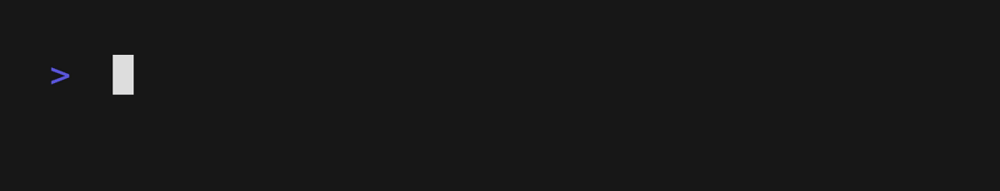

  <h1>👷 Software / Backend / Computer science engineer</h1>
  

     <strong>Hard/Soft skills:</strong> 
    <strong><a href="https://github.com/Mariama4/Mariama4/blob/main/SKILLS.md" target=”_blank”>Programming & JS & Node.js</a></strong>
  

  

    <strong>Publications:</strong> 
    <a href="https://www.elibrary.ru/item.asp?id=50352543" target=”_blank”><strong>Elibrary</strong></a>
  

  

    <strong>Interviews:</strong> 
    <a href="https://edexpert.ru/data-analysis#:~:text=%D0%B8%D1%81%D1%81%D0%BB%D0%B5%D0%B4%D0%BE%D0%B2%D0%B0%D1%82%D0%B5%D0%BB%D1%8C%D1%81%D0%BA%D0%BE%D0%B3%D0%BE%20%D0%B4%D0%B0%D1%82%D0%B0%2D%D0%BF%D1%80%D0%BE%D0%B5%D0%BA%D1%82%D0%B0.-,%D0%93%D0%B5%D0%BE%D1%80%D0%B3%D0%B8%D0%B9%20%D0%A2%D0%B0%D1%81%D0%BA%D0%B0%D0%B1%D1%83%D0%BB%D0%BE%D0%B2,-%D1%83%D1%87%D0%B0%D1%81%D1%82%D0%BD%D0%B8%D0%BA%20%C2%AB%D0%94%D0%B0%D1%82%D0%B0%2D%D0%9A%D0%B0%D0%BC%D0%BF%D1%83%D1%81%D0%B0" target=”_blank”> 
      <strong>«Дата-Кампус»</strong>
    </a>
  

    

    <strong>Sites:</strong> 
    <a href="https://mariama4.github.io/blog/" target=”_blank”><strong>Blog</strong></a>
  

#

          
   
<!--         
    -->
   </a>

 
   
   
   
   
   
   
   
   
   
   
  

    
   
    
   

---

 
   
   
   

